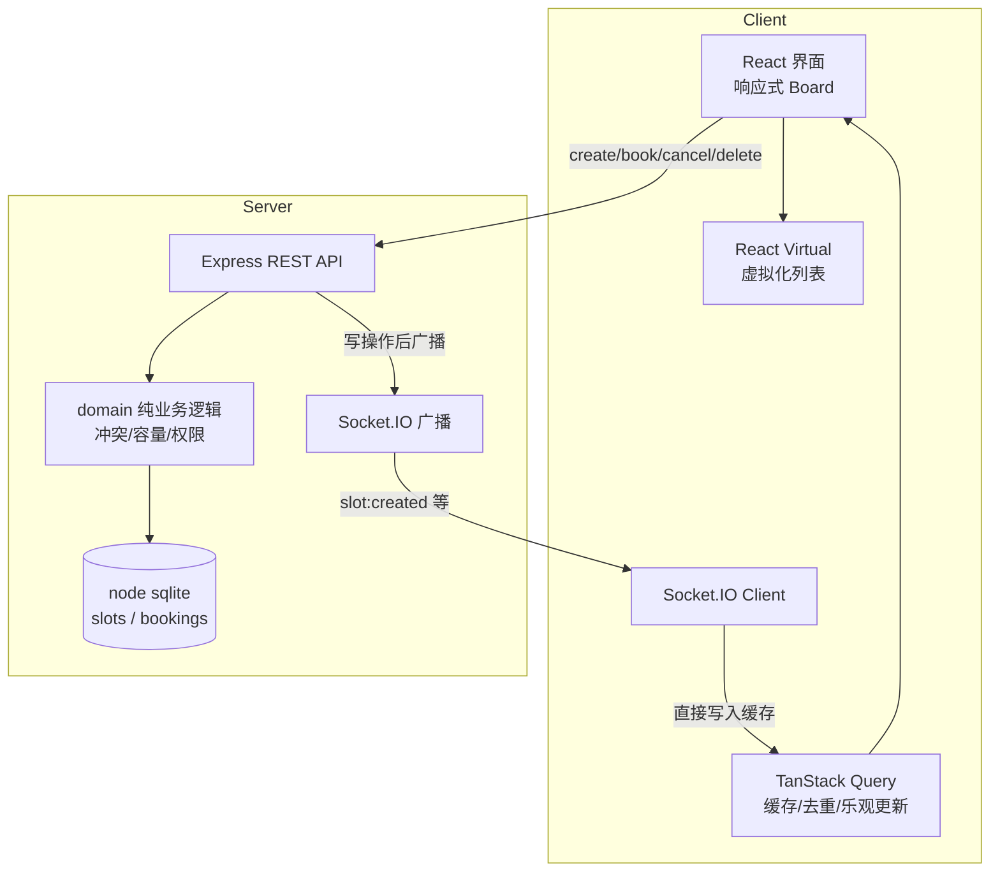

# Real-time Booking Board · 实时协同预约排班看板

> 一个**多人实时协同**的全栈作品：前端 React + TypeScript，后端 Express + 内置 SQLite，中间用 WebSocket 做实时同步。
> 它不是一个"演示页"，而是一条完整链路。业务规则（冲突检测 / 容量 / 权限）全部在**后端强制**，前端用**乐观更新**即时反馈。

**一句话定位：** 展示"全链路理解 + 性能优化 + 知道哪些该自己掌控"。

---

## 演示能力一览

| 层次 | 你可以在作品里看到 |
| --- | --- |
| 需求/设计稿 → 界面 | 响应式布局，同一组件在手机/桌面自适应 |
| 交互 + 数据展示 | 新建 / 预约 / 取消 / 删除，真实接口，数据来自后端 + 实时推送 |
| 后端交互 → 全链路 | 自己写的 REST + 内嵌 SQLite + 外键级联 |
| 实时协同 | Socket.IO，多人打开页面，任何写操作所有端即时同步 |
| 性能 | 虚拟化列表 / 请求缓存去重 / 代码分包 / 防抖（见下方实测数据） |
| AI 判断 | 样板代码交给 AI，核心规则、并发一致性、性能路径、安全边界自己掌控 |

---

## 技术栈

| 层 | 选择 | 说明 |
| --- | --- | --- |
| 前端 | React 18 + TypeScript + Vite 5 | 主流、工程化好 |
| 样式 | Tailwind CSS 3 | 响应式 / 快速 |
| 服务端状态 | TanStack Query 5 | 缓存、请求去重、乐观更新现成 |
| 虚拟化 | TanStack React Virtual | 大量数据只渲染可视区 |
| 实时 | Socket.IO | 双向推送，自带重连与降级 |
| 后端 | Node.js + Express 4 + TypeScript | 生态成熟 |
| 数据库 | node:sqlite（Node 24 内置） | **零原生依赖**，`npm install` 即可跑 |
| 测试 | Vitest + Testing Library | 单元 + 组件测试 |

> **为什么选 node:sqlite：** Node 22.5+ / 24 内置，不需要编译原生模块，也不会让"克隆后跑不起来"。演示、CI、Docker 都简单。这是刻意降低部署门槛的取舍。

---

## 架构



**数据流一句话：** 前端乐观更新让用户"点完立即有反馈" → 请求到后端 → 后端用**纯函数 domain 层**做权威校验并落库 → Socket.IO 把服务端权威状态广播给**所有**客户端 → 其他端直接写进 Query 缓存，全员一致。

**核心原则：后端是权威。** 前端乐观更新只是体验优化，最终一致性由后端兜底——这是区分"会写页面"和"理解系统"的地方。

---

## 关键设计（讲深度用）

### 1. 领域逻辑纯函数化
`server/src/domain.ts` 只依赖类型，不依赖 DB / 网络，因此可单测。所有"能不能约 / 删 / 取消"的规则集中在这里：
- 时间合法性（结束晚于开始、单次 ≤6 小时、不允许过去）
- 容量上限 1–64
- **跨排班位的时间冲突**：同一用户不能约两个时间重叠的排班
- 权限：只有创建者能删除

### 2. 专为并发做的后端校验
两个用户同时抢最后一个名额，前端看起来都能约；但服务端容量检查只放行一个，另一个返回 `SLOT_FULL`，前端回滚。这个竞态处理放在后端，是"理解系统"的关键证据。

### 3. 数据层显式列别名，避免 snake_case / camelCase 错位
数据层用 `col AS camelCase` 映射，而不是 `SELECT *`。`SELECT *` 会把 `start_time` 直接塞进领域对象，导致 `startTime` 为 `undefined`，冲突检测静默失效。这是记录在案的踩坑与修复。

### 4. 状态分两类
- **服务端状态**（排班列表）：Query 缓存 + Socket 实时写缓存。
- **一次性 UI 状态**（弹窗、toast、昵称）：`useState` / `localStorage`。

---

## 性能优化（有实测数据，不是名词堆砌）

构建产物实测（`vite build`，gzip）：

| Chunk | 体积 | gzip |
| --- | --- | --- |
| `react` | 137.49 kB | 43.95 kB |
| `query` | 65.05 kB | 19.14 kB |
| `socket` | 41.61 kB | 13.03 kB |
| `vendor` | 4.10 kB | 1.78 kB |
| `index` | 12.86 kB | 4.58 kB |
| `index.css` | 11.61 kB | 3.11 kB |
| **合计** | | **约 85.6 kB** |

**做了什么：**
1. **虚拟化列表**：`@tanstack/react-virtual`，无论 10 条还是 1000 条，DOM 节点数恒定（≈可视区 + overscan），首屏渲染不随数据量线性增长。
2. **服务端状态缓存 + 请求去重**：`staleTime: 30s`，多组件共享同一 `['slots']` 键；乐观更新 `onMutate` 改缓存 → `onError` 回滚 → `onSettled` 刷新。
3. **代码分包 + 手动 chunk**：`react/query/socket/vendor` 独立拆分，实现长缓存。
4. **防抖搜索**：`useDebouncedValue`（250ms），避免每次按键都触发过滤。

> **诚实说明：** 虚拟化与缓存我做了**代码层面**的量化和构建层面的 gzip 数据；但没跑真实浏览器 Lighthouse 基准（本地未装无头浏览器）。如需，可用 `lighthouse http://localhost:3000` 补一份性能分。我不编一个没测过的数字。

---

## 快速开始

要求：**Node >= 22.5**（用到内置 `node:sqlite`）。

```bash
# 1. 安装依赖（根目录，workspaces 一键装齐 server + client）
npm install

# 2. 开发模式：同时起前端(5173) + 后端(3000)，Vite 代理 /api 与 /socket.io
npm run dev
# 打开 http://localhost:5173

# 3. 只跑单元 + 组件测试
npm test

# 4. 类型检查
npm run typecheck

# 5. 生产构建（server 出 dist，client 出 dist）
npm run build

# 6. 生产运行（单进程托管前端静态文件 + API + Socket.IO + SPA 回退）
npm run start
# 打开 http://localhost:3000
```

### 用 Docker 跑

```bash
docker build -t realtime-booking-board .
docker run -p 3000:3000 realtime-booking-board
# http://localhost:3000
```

或用 docker compose：

```bash
docker compose up --build
```

### 实时冒烟测试（真连 Socket.IO）

```bash
# 先在一个终端跑后端（npm run start 或 npm run dev 的后端部分）
node scripts/realtime-smoke.mjs
# 预期输出：REALTIME PASS（收到 sync / slot:created / booking:created）
```

---

## API

| 方法 | 路径 | 说明 |
| --- | --- | --- |
| GET | `/api/health` | 健康检查 |
| GET | `/api/slots` | 列出全部排班位（含预约与占用数） |
| POST | `/api/slots` | 新建排班位 |
| DELETE | `/api/slots/:id` | 删除（仅创建者；body/query 传 `requesterId`） |
| POST | `/api/slots/:id/book` | 预约（body 传 `userId`） |
| POST | `/api/bookings/:id/cancel` | 取消预约 |

业务错误码：`INVALID_INPUT(400)` / `PAST_SLOT(409)` / `SLOT_NOT_FOUND(404)` / `SLOT_FULL(409)` / `OVERLAP(409)` / `NOT_OWNER(403)` / `BOOKING_NOT_FOUND(404)` / `SLOT_DELETED(410)`。

---

## 项目结构

```
code/
├─ server/                 # Node + Express + node:sqlite
│  ├─ src/
│  │  ├─ domain.ts         # 纯业务规则（冲突/容量/权限）
│  │  ├─ db.ts             # 数据层（node:sqlite，列别名映射）
│  │  ├─ routes.ts         # REST 路由
│  │  ├─ socket.ts         # Socket.IO 广播
│  │  └─ index.ts          # 启动 + 生产托管前端
│  └─ tests/domain.test.ts # 18 个领域单测
├─ client/                 # React + Vite + Tailwind
│  └─ src/
│     ├─ pages/Board.tsx         # 响应式看板
│     ├─ components/SlotList.tsx # 虚拟化列表
│     ├─ components/SlotCard.tsx # 排班卡（memo + 状态驱动按钮）
│     ├─ hooks/useSlots.ts       # Query + Socket 写缓存
│     ├─ hooks/useBooking.ts     # 乐观更新 + 回滚
│     └─ lib/api.ts / socket.ts  # 客户端 API 与实时连接
├─ scripts/realtime-smoke.mjs # 真连 Socket.IO 的冒烟测试
├─ Dockerfile                 # 多阶段构建
└─ package.json               # workspaces（server + client）
```

---

## 已知局限（如实记录）

- **无真正的身份认证**：用昵称 + `localStorage` 模拟，`creatorId` 可被篡改（客户端只做 UI 权限，服务端仍按创建者校验删除）。真实项目应替换为 JWT / session 并做服务端鉴权。
- **单进程 / 单 SQLite 文件**：适合演示和中小规模。多人高并发、多实例部署需换 Postgres + Redis（缓存/分发 Socket）。
- **未跑 Lighthouse 基准**：只有构建层 gzip 数据 + 代码层虚拟化保证。
- **npm audit 告警**（依赖审计，详见 `docs`）：vite/vitest（仅本地 dev-server）与 express/qs（中等 DoS），均有默认限制兜底；升级 vite 8 / express 5 属破坏性变更，暂未做。

---

## 逐步完善方向

- 真正的登录 + 服务端鉴权，替代昵称模拟。
- 用户维度视图（"我的预约"）。
- 周/月日历视图切换。
- 用 Postgres + Redis 做多实例横向扩展。
- 补 Lighthouse 性能基准（当前有构建 gzip 数据 + 代码层虚拟化保证）。
